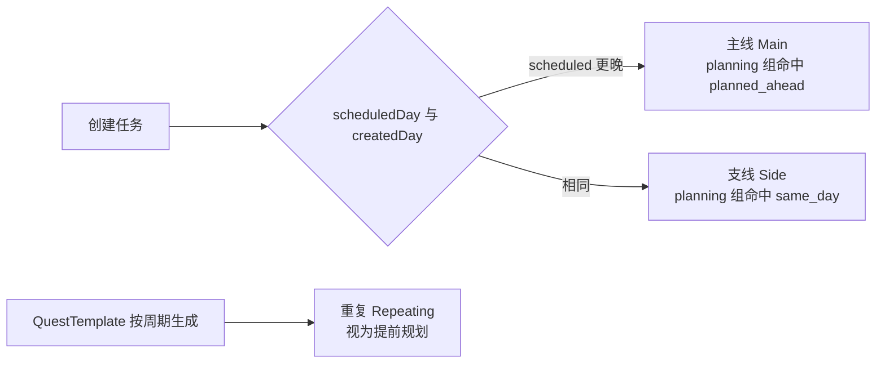

# 状态流

## 每日结算（DayCycleService）

启动或回到前台时触发，必须满足两个性质：**可补算**（玩家几天没开 App）与**幂等**（同一天不重复结算）。

```
let today = calendar.gameDay(for: .now)
guard today > player.lastActiveDay else { return }

for day in (player.lastActiveDay + 1) ... today {
    1. finalize(dayBefore)      // 封存 DailyRecord，isFinalized = true 作为幂等闸门
    2. markOverdue(day)         // 该日之前未完成的定日任务标记延期
    3. generateFromTemplates(day) // 按 QuestTemplate 生成当日重复任务实例
    4. advanceStreaks(day)      // 登录连续、习惯连续
}
player.lastActiveDay = today
runUnlockEngine()
```

补算上限为 400 天，避免用户改系统时间导致的极端循环。

## 完成任务

```
completeQuest(quest)
  → RewardEngine.evaluate(context) → RewardResult
  → 写入 RewardTransaction（记录 exp / gold / 每个技能的分配明细）
  → 应用到 Player.totalEXP / Player.gold / Skill.totalEXP
  → 累加进当日 DailyRecord
  → MetricsService.snapshot() → UnlockEngine.evaluate() → 发放新解锁奖励
```

## 撤销完成

读取该任务对应的 `RewardTransaction`，按记录的数值原样反向扣除，然后把流水标记为 `isReverted`。**不重新计算公式**，因为公式或配置可能已经变了，重算会导致数值漂移。

升级奖励是个例外：它挂在 `sourceID = nil` 的独立流水上，撤销任务时不倒扣。作为代价，`Player.highestLevelRewarded` 记录了已发放奖励的最高等级水位，同一级永远只发一次。没有这道水位线，"完成 → 撤销 → 再完成"就能无限刷金币。

## 任务类型的派生



## 解锁引擎

`MetricsService` 把 Player、Skill、Habit、DailyRecord 摊平成一个 `MetricsSnapshot`（纯字典），`UnlockEngine.evaluate` 是纯函数：

```
(MetricsSnapshot, [UnlockRule], Set<已解锁ID>) -> [UnlockRule]  // 新满足的
```

成就、称号、挑战三者共用这套机制，区别只在 `kind` 字段。挑战的进度条直接用 `snapshot.value(metric) / threshold` 算出，不需要额外存储进度。
