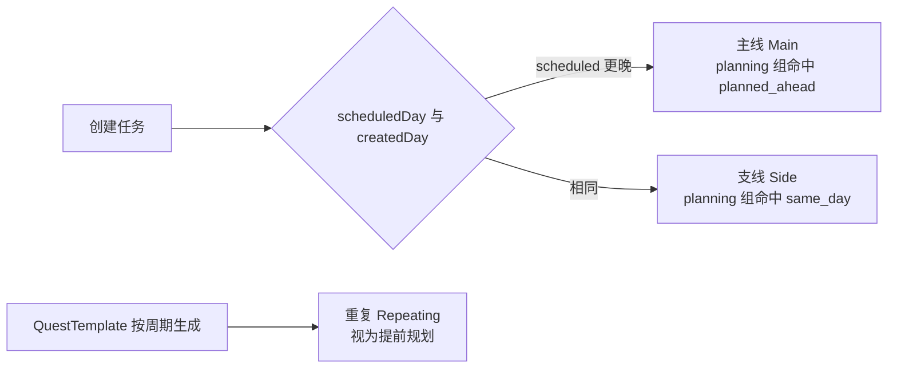

# 状态流

## 每日结算（DayCycleService）

启动或回到前台时触发，必须满足两个性质：**可补算**（玩家几天没开 App）与**幂等**（同一天不重复结算）。

```
let today = calendar.gameDay(for: .now)

if lastActiveDay == 0:
    lastActiveDay = today
else if today > lastActiveDay:
    for day in (lastActiveDay + 1) ... today:   // 上限 400 天
        1. finalize(dayBefore)      // 封存 DailyRecord，isFinalized 作为幂等闸门
        2. 可选 carryOver           // 未完成的单次任务顺延到 day，并标延期

applyStreakShieldIfNeeded()         // 漏登恰好一天且持有护盾 → 填上缺口
decayBrokenStreaks()                // 习惯 / 周期 / 登录的虚高连续清零
settleAndGenerate(through: today)   // 关窗口 + 生成今日周期实例
markOverdue(before: today)          // 截止已过的单次任务标延期（暂停日跳过）
failExpiredSingles(on: today)       // 逾期超过 3 个活跃日 → 失败
advanceLoginStreak(on: today)
refresh DailyRecord(today)
runUnlockEngine()
```

暂停日（请假卡）不生成周期实例、不标延期、不判失败，也不计入窗口的活跃天数。

## 周期窗口（RecurringPeriodEngine）

模板以 7 个**未暂停**日为一窗，配额由规律决定（每天一次、每周指定星期、每周 N 次等）。

```
窗口结束时:
  达成配额 → 记一段旅途（completedJourneys + 1），开新窗口，state = active
  未达成且当前是 active → 进入 grace（延期补债周），待办标逾期
  未达成且当前已是 grace → 写入 FailedQuestRecord，取消该模板全部 pending 实例
```

宽限周内 `canComplete` 放宽到任意活跃日，方便补债；奖励仍按延期结算（`forceOverdue`）。

单次任务失败：`today` 超过截止日（或计划日）超过 3 个活跃日后取消，同样写入失败快照。界面用 alert 列出本次新失败的标题。

## 结束远行

每一段周期窗口是一段旅途。走完配额就算一段经历；玩家也可以主动收队，结束整趟远行：

```
finishTemplate(template)
  → 按 startDay 到今天的持续天数 + 途中完成次数计算归途奖励
  → 停生成、isActive = false、取消全部 pending
  → 累加 Player.totalRecurringSeriesFinished / longestRecurringSeriesDays
  → 发放高额 EXP / 金币，再走解锁引擎
```

奖励公式在 `RecurringFinishEngine`：持续天数是主因，7 / 30 / 100 / 365 天有档位加成。这与窗口失败不同——失败会写 `FailedQuestRecord` 并开新窗，收队是正面归途。

## 完成任务

```
completeQuest(quest)
  → RewardEngine.evaluate(context) → RewardResult
  → 写入 RewardTransaction（记录 exp / gold / 每个技能的分配明细）
  → 应用到 Player.totalEXP / Player.gold / Skill.totalEXP
  → 累加进当日 DailyRecord
  → 行内弹出 EXP / 金币、默认触感；若装备特效 / 音效再叠一层
  → MetricsService.snapshot() → UnlockEngine.evaluate() → 发放新解锁奖励
```

## 撤销完成

读取该任务对应的 `RewardTransaction`，按记录的数值原样反向扣除，然后把流水标记为 `isReverted`。**不重新计算公式**，因为公式或配置可能已经变了，重算会导致数值漂移。

升级奖励是个例外：它挂在 `sourceID = nil` 的独立流水上，撤销任务时不倒扣。作为代价，`Player.highestLevelRewarded` 记录了已发放奖励的最高等级水位，同一级永远只发一次。没有这道水位线，"完成 → 撤销 → 再完成"就能无限刷金币。

## 任务类型的派生



失败后状态变为 `cancelled`，不再出现在告示栏；历史页读 `FailedQuestRecord`。

## 连胜保护与请假

```
法术护盾:
  持有中 + 距上次登录恰好缺口 > 1 天
  → StreakEngine.applyShield 把 lastDay 填到漏掉的第一天
  → 护盾清空，弹出「已保护连胜」
  → 若缺口更大，随后的 decayIfBroken 仍会清零

请假卡:
  库存 -1，把该 GameDay 写入 Player.pausedDayValues
  → 当日不推进周期窗口、不生成实例、不判失败
```

## 本地通知

`NotificationPlanner` 是纯函数，每次全量重建：

- 18 小时未打开
- 超过 1 天未使用
- 任务截止前 1 小时（最多约 62 条，给系统提醒留额度）

不再按「明日规划 / 睡觉」整点排程。

## 解锁引擎

`MetricsService` 把 Player、Skill、Habit、DailyRecord 摊平成一个 `MetricsSnapshot`（纯字典），`UnlockEngine.evaluate` 是纯函数：

```
(MetricsSnapshot, [UnlockRule], Set<已解锁ID>) -> [UnlockRule]  // 新满足的
```

成就、称号、挑战三者共用这套机制，区别只在 `kind` 字段。挑战的进度条直接用 `snapshot.value(metric) / threshold` 算出，不需要额外存储进度。

## 新手引导

登记完成后 `AppSettings.hasCompletedTutorial = false`。`GameStore` 按 `TutorialStep` 推进，宿主分别是首页、Tab、成长页、发布向导、习惯编辑器。遮罩只高亮真实锚点；填表步骤允许点到输入框。完成后才放开正常导航。
